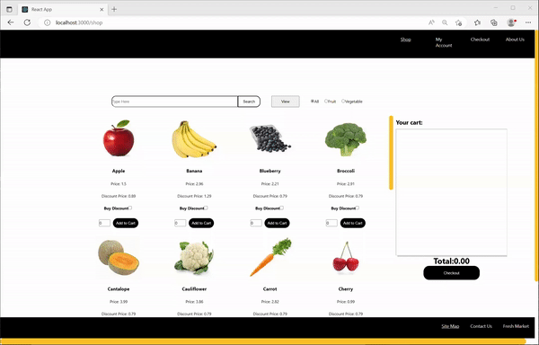
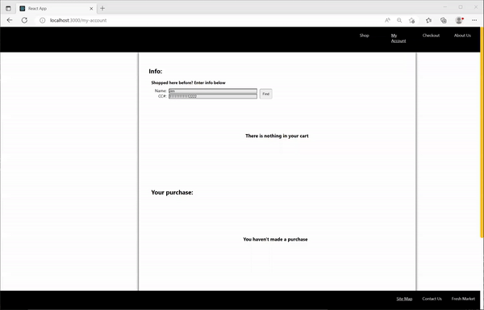
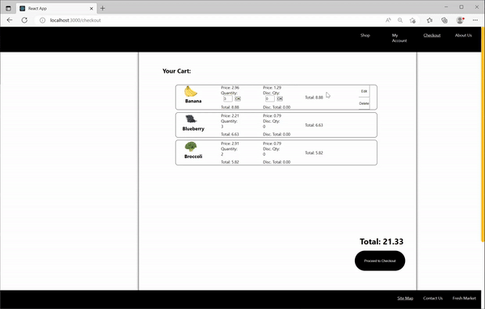

# Project No.3

This is a project built for the Flatiron Flex program Phase 3, called Fresh Market, a simple e-commerce app. In addition to the frontend using React, this features the backend communication using MVC (Model, View, and Controller): Sinatra as a source for the controller, as it handles the endpoints for requests by the client, ActiveRecord to create SQL commands, and Ruby for classes and methods.

# Project Description

Fresh Market is a simple e-commerce app that aims to change the economic business model.  With million pounds of produces wasted by the United States alone, this app hopes to sell produces that have a longer shelf span at the store for a more affordable price.

## Frontend Features ##

# Shop

Fresh Market allows users to simply select items at the homepage, Shop.  There, the user may select a number below each produce card and click 'Add to Cart.'  Additionally, user can click on the checkbox above, which will display the number input where the user may select the amount for discounted produce as well.

# Filter

Users can click on the radio buttons on the right most above the produce menu to display either fruits or vegetables.  User can also type in a particular produce at the search bar.

# View

User can switch between produce cards (default) and list for viewing experiences.  Either choices still operates the produce selection similarly.

# MyAccount

User can also view the items at the cart belt at the middle of the page.  User can click on the right to view more or return to the earlier selected items.

If the user has shopped in the past, that user may type in the name followed by credit card information used to purchase the items to view the purchase history.

# Checkout

User can update the quantity in this page (as well as the Shop page) by hovering over a produce which will then display the button (as well as delete).  If the user selects '0' for both quantity and discount quantity, the produce will be deleted.

# AccountInfo

User will provide basic information such as name, phone number, credit card information before proceeding to the submit page.  if the user has shopped at the store, user can click on the checkbox and enter name and credit card information before advancing to the Confirm page.

# Confirm

Before submitting the cart, user will see the receipt of all the products in the cart, as well as the information entered from the previous page.
